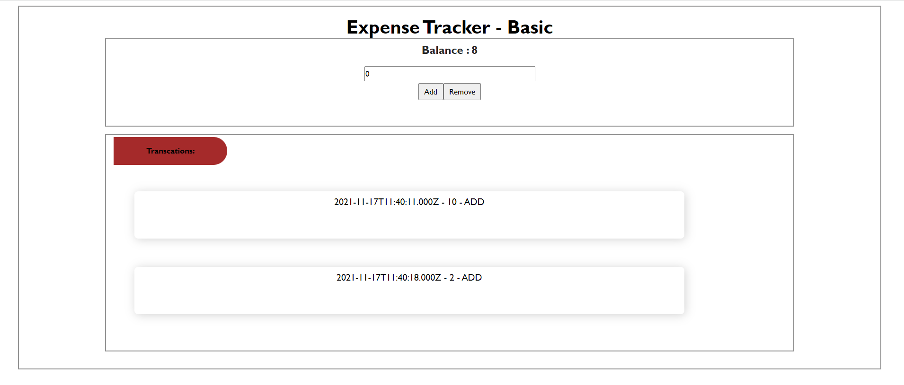

- Build the system by < package manager > npm i or pnpm i
- start the app by npm start or pnpm start
---
- The app is bootstraped with create-react-app with typescript template
- For managing state i employed redux-toolkit

---
